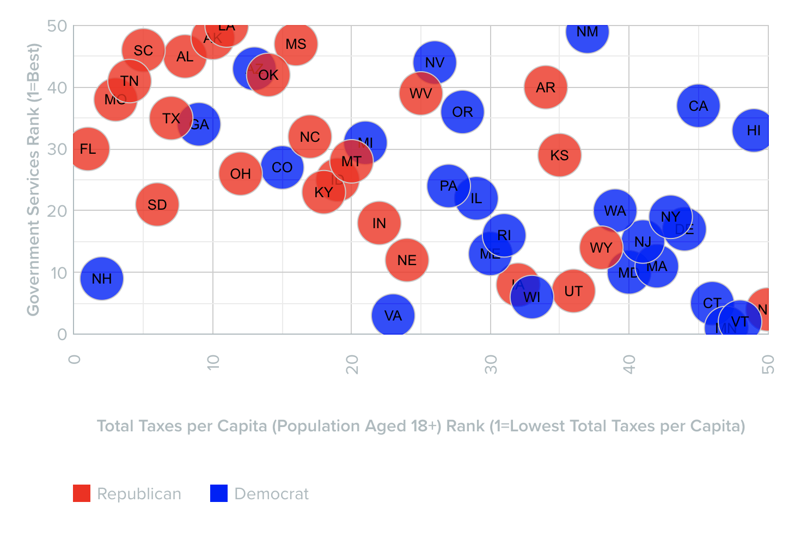

```{r setup, include=FALSE}
knitr::opts_chunk$set(echo = FALSE, message=FALSE, fig.align = "center")

library(ggplot2)
library(readr)
library(ggrepel)
library(tidyr)
library(broom)
library(knitr)
library(dplyr)

# Read in WalletHub dataset with partisan control variables added
ranks <- read.csv('./data/State_Rankings.csv', stringsAsFactors = TRUE)

# Read in .csv with tax foundation tax burden and census tax/revenue data
st_ROI_holist <- read.csv('./data/Ranks_Tax_ROI_2020_State_local.csv') 
st_ROI_holist$X2020_Tax_Burden <- parse_number(st_ROI_holist$X2020_Tax_Burden)

st_ROI_holist$ST <- state.abb

# Add National Assessment of Educational Progress test scores from most recent available year downloaded from
# https://www.nationsreportcard.gov/profiles/stateprofile
test_scores <- read.csv('./data/NAEP_Math_Reading_Scores_2019.csv')
st_ROI_holist$Eigth_math_scores <- test_scores$NAEP_Math_2019
st_ROI_holist$Eigth_read_scores <- test_scores$NAEP_Reading_2019

# Add student enrollment data from National Center for Education Statistics downloaded from
# https://nces.ed.gov/programs/digest/d22/tables/dt22_203.20.asp
num_students <- read.csv('./data/state_student_enrollment.csv')
st_ROI_holist$num_stdnts_2020 <- parse_number(num_students$Fall.2020)

# Calculate total state/local expenditures per student
st_ROI_holist$ed_spend_per_stdt <- st_ROI_holist$Elementary_._secondary/st_ROI_holist$num_stdnts_2020

# Calculate per Capita Health Expenditures
health_percap <- st_ROI_holist$Health_Expenditures/st_ROI_holist$POP_2020

# Read in life expectancy data from CDC https://www.cdc.gov/nchs/pressroom/sosmap/life_expectancy/life_expectancy.htm
life_expect <- read.csv('./data/st_life_expectancy_2020.csv')
st_ROI_holist$life <- life_expect[1:50,3]

# Read infant mortality data from CDC https://www.cdc.gov/nchs/pressroom/sosmap/infant_mortality_rates/infant_mortality.htm
inf_mort <- read.csv('./data/inf_mort_2020.csv')
st_ROI_holist$inf_mort <- as.numeric(inf_mort[1:50,3])

# Read obesity data from CDC https://www.cdc.gov/obesity/data/prevalence-maps.html
obesity <- read.csv('./data/obesity_2020.csv')
obese <- subset(obesity, State!="District of Columbia" & State!="Guam" & State!="Puerto Rico" )
st_ROI_holist$obesity <- obese$Prevalence

# Create generic plotting function
tax_plot <- function(x,y,x_title,y_title) {

  graph <- ggplot(st_ROI_holist, aes(x={{x}},y={{y}},label=ST))+
    geom_point(aes(color=Control,size=POP_2020/1000000))+
    scale_color_manual(values=c("blue","red","orange"))+
    geom_text_repel(size=2)+
    geom_smooth(method='lm')+
    theme_bw()+
    theme(legend.title=element_text(size=8))+
    labs(x=x_title,y=y_title, size="Population\n(millions)")
  
  return(graph)
}
```

# Introduction

In the U.S.' two-party system, increased polarization has renewed attention to 'Red' vs. 'Blue' states, exemplified by the feud between Florida's Republican Governor DeSantis and California's Democratic Governor Newsom[^1]. Each argues that their state represents a clear choice between distinct policies and outcomes, and the Economist recently argued that this trend would increasingly [shape state policies](https://www.economist.com/interactive/briefing/2022/09/03/american-policy-is-splitting-state-by-state-into-two-blocs) in the future. Is this case? If a different political party controls state governments, do we see different policies and associated outcomes? To what extent do these policy differences significantly affect outcomes for citizens?

[^1]: Full Disclosure: I work for [Govern for California](https://governforcalifornia.org/), a Newsom donor

In June of 2021, [CNN's Fareed Zakaria reported](https://www.cnn.com/videos/tv/2021/06/27/exp-gps-0627-fareeds-take.cnn) on a [WalletHub analysis](https://wallethub.com/edu/state-taxpayer-roi-report/3283) that claims to show just that:



# No Easy Answers

While the WalletHub analysis simplifies some complex data sets into insights effectively, there are some issues. Visually, the graph's y axis is inverted, which gives the misleading impression that more 'Red' states have better services, when the opposite is true. While the axis label clarifies this, it's not natural to look at the lower left quadrant to find the best performers.

The methodology also raises questions. States are coded according to how they voted in the 2020 Presidential election rather than which party controls state government, and states look very different depending on whether we look at the legislature, governorship or both. That the 2020 election was very close and produced some upsets doesn't help; the Republican stronghold of Georgia going to Biden, for example.

It also doesn't make sense to calculate a per capita tax amount by dividing total state income tax revenues by individuals 18 or older nor to exclude local taxes and federal transfers. There are other taxes (sales and use, licensing, etc.) that will be borne by much wider tranches of society, and just because someone is 18 or older is not a guarantee that they are employed nor earn enough to pay taxes. For example, the [Institute on Taxation and Economic Policy](https://itep.org/whopays-map/) regularly reviews how 'equitable' state tax policies are. Though many states may raise significant amounts of tax revenue per capita, those who actually pay the taxes can be concentrated among high-earners, often referred to as 'progressive' tax structures. Looking at this data, average earners in Texas may actually [pay more taxes](https://www.houstonchronicle.com/news/houston-texas/texas/article/texans-pay-more-in-taxes-than-california-data-show-17390051.php?) than in California, even though California technically has much higher income tax rates. Tax revenue sources vary from state to state and may or may not reflect that state's primary revenue source nor what a typical resident can expect to pay to the government as a share of income.

Instead, we can use the [tax burden](https://taxfoundation.org/tax-burden-by-state-2022/) to estimate the total amount of taxes paid relative to that state's share of the net national product and recreate a version of WalletHub's analysis. In lieu of the 2020 Presidential vote, states are coded according to which political parties controlled its Executive and Legislative Branches in 2020: R for Republican, D for Democratic and S for split control between the two parties.

```{r}
tax_plot(X2020_Tax_Burden,Total_Score,"2020 Tax Burden (%)","WalletHub Total Service Quality Score")
```

```{r}
summary(lm(st_ROI_holist$Total_Score~st_ROI_holist$X2020_Tax_Burden))%>%
  tidy() %>%
  mutate(term = c("Intercept","Tax Burden"), 
         p.value = scales::pvalue(p.value),
         ) %>%
  kable(col.names = c("Predictor", "B", "SE", "t", "p"),
    digits = c(0, 2, 3, 2, 3),
    caption = "Tax Burden's Effect on Quality Score: Linear Estimate",
    align = c("l", "c", "c", "c", "c"))
```

Surprisingly, more so for reasons we'll see below, a higher tax burden correlates with a better rank in the WalletHub methodology. There is significant variation unrelated to party control, though there are clusters of Republican states with lower tax burdens and Democratic states with higher tax burdens which are statistically significant. It's also worth noting that throughout this analysis, two of the largest Democratic run states, CA and NY, seem to be outliers, in that their increased spending does not often reflect the better outcomes we might expect.

```{r}
TukeyHSD(aov(st_ROI_holist$X2020_Tax_Burden~st_ROI_holist$Control))%>%
  tidy() %>%
  mutate(term = c("Party Control","Party Control","Party Control"), 
         adj.p.value = scales::pvalue(adj.p.value),
         ) %>%
  kable(col.names = c("Predictor", "Comparison", "Null", "Estimate", "Low","High","p"),
    digits = c(0, 0, 1, 2, 3, 2, 3),
    caption = "Party Control's Effect on Tax Burden: Tukey's HSD",
    align = c("l", "c", "c", "c", "c","c","c","c"))
```

Another note is that a high ROI score doesn't mean that the quality of services is very good, despite being efficient. For example, although Missouri ranks 38th in service quality, it ranks 5th for ROI just by dint of not spending very much. Similarly, FL ranks 30th in service quality and 2nd for ROI. CA is 37th in service quality, and though its raw service quality score of 46.5 is not far from Florida at 51.05 or Texas at 47.93, its ROI rank is 49 because it collects significantly more income tax revenue, albeit from a smaller population of higher earning taxpayers.

Statistically, the only significant result we find from the original WalletHub data is that states that voted Democratic in the 2020 Presidential election generally have better services.

```{r DvR, echo=FALSE}
ggplot(ranks,aes(x=Total.Score,group=X2020.Vote,fill=X2020.Vote))+
  geom_density(alpha=0.5)+theme_bw() + scale_fill_manual( values = c("blue","red"))+
  labs(x="Total Score",fill="2020\nPresidential\nVote")
```

```{r, comment=NA}
t.test(ranks$Total.Score~ranks$X2020.Vote)
```

However, as the next section will show, actual control of the Executive and Legislative Branches is not correlated with better quality services.

# Who's in Office?

Partisan results from a single election is a poor proxy for government control, since some purple states may vote for a Democratic President while the Republican Party still controls the Legislature and/or Governor's office. To examine this, we added three new variables to indicate which party controls each of the Legislative and Executive Branches, and whether each state's Executive and Legislative branches were both controlled by one party or split between the two.

When we look at the Legislature, Governorship and overall control, results are muddy, with the only statistically significant difference between the three groups being that split legislature states provide better services than Republican legislature states, and with only two split legislatures, this conclusion isn't reliable either.

## Legislature

```{r, echo=FALSE}
ggplot(ranks,aes(x=Total.Score,group=Legislature,fill=Legislature))+
  geom_density(alpha=0.5)+theme_bw() + scale_fill_manual( values = c("blue","red","orange"))+
  labs(x="Total Score")
```

```{r}
summary(lm(ranks$Total.Score~ranks$Legislature))%>%
  tidy() %>%
  mutate(term = c("Intercept","Republican Legislature","Democratic Legislature"), 
         p.value = scales::pvalue(p.value),
         ) %>%
  kable(col.names = c("Predictor", "B", "SE", "t", "p"),
    digits = c(0, 2, 3, 2, 3),
    caption = "Party Legislative Control's Effect on Quality Score: Linear Estimate",
    align = c("l", "c", "c", "c", "c"))
```

```{r}
TukeyHSD(aov(ranks$Total.Score~ranks$Legislature))%>%
  tidy() %>%
  mutate(term = c("Party Control","Party Control","Party Control"), 
         adj.p.value = scales::pvalue(adj.p.value),
         ) %>%
  kable(col.names = c("Predictor", "Comparison", "Null", "Estimate", "Low","High","p"),
    digits = c(0, 0, 1, 2, 3, 2, 3),
    caption = "Legislative Party Control's Effect on Tax Burden: Tukey's HSD",
    align = c("l", "c", "c", "c", "c","c","c","c"))
```

## Governors

The difference between states with Republican and Democratic governors is not statistically significant, though states with Democratic governors seem to vary less than those with Republican governors.

```{r, echo=FALSE}
ggplot(ranks,aes(x=Total.Score,group=Governor,fill=Governor))+
    geom_density(alpha=0.5)+theme_bw() + scale_fill_manual( values = c("blue","red"))+
  labs(x="Total Score")
```

```{r,comment=NA,tidy=TRUE}
t.test(ranks$Total.Score~ranks$Governor)
```

## Overall Control

When we include the Governorship, control comprises 15 Democratic states, 24 Republican and 11 split between the two; however, overall party control isn't significantly correlated with WalletHub's service quality scores either.

```{r, echo=FALSE}
ggplot(ranks,aes(x=Total.Score,group=Control,fill=Control))+
  geom_density(alpha=0.5)+theme_bw() + scale_fill_manual( values = c("blue","red","orange"))+
  labs(x="Total Score")
```

```{r}
anova(lm(ranks$Total.Score~ranks$Control))%>%
  tidy() %>%
  mutate(term = c("Party Control","Residuals"), 
         p.value = scales::pvalue(p.value),
         ) %>%
  kable(col.names = c("Predictor", "DF", "SumSq","MeanSq", "Stat", "p"),
    digits = c(0, 2, 2, 2, 3),
    caption = "Overall Party Control's Effect on Quality Score: Linear Estimate",
    align = c("l", "c", "c", "c", "c"))
```

# Tax and Spend

Despite the problems with WalletHub's analysis, the concept is intriguing, so we decided to look more closely at the relationship between revenue, spending and service quality. Although states collect money in different ways and amounts, wouldn't their spending reveal more about their priorities and be a better predictor of service quality? What happens when we look at state and local spending in specific areas? Are there better ways to evaluate government service performance?

Rather than fixating on taxes, we instead looked at total state and local expenditures, including federal transfers, which should have a stronger relationship with government service quality. To do this, we included a dollar amount for [local and state revenue and expenditures](https://www.census.gov/data/datasets/2020/econ/local/public-use-datasets.html) from the 2020 Census. But when we look at overall state and local expenditures per capita, there isn't a statistically significant relationship with WalletHub's quality score, which is surprising given what we found when we ran the same analysis with the tax burden.

```{r}
tax_plot(Direct_expenditure/POP_2020,Total_Score,"State/Local Expenditures per Capita 2020 (thousands)","Total Score")
```

## Education

More surprising is the strong negative correlation between spending on education and WalletHub's education score. As these are heavily weighted with two of WalletHub's other ranking indexes for [public schools](https://wallethub.com/edu/e/states-with-the-best-schools/5335) and [universities](https://wallethub.com/edu/e/college-rankings/40750), it could be that this index of indexes is over-abstracted to the point it is no longer strongly connected to student outcomes.

```{r}
tax_plot(ed_spend_per_stdt,Education_Score,"State/Local Primary and Secondary Education Expenditures\nper Enrolled Student 2020 (thousands)","WalletHub Education Score")
```

This raises some questions about WalletHub's education score methodology, since we can generate counter-examples. When we compare [8th grade math and reading scores from 2019](https://www.nationsreportcard.gov/profiles/stateprofile), the most recent year available, we see a significant correlation between per student spending on primary and secondary education and test scores. CA and NY are notable exceptions.

```{r}
tax_plot(ed_spend_per_stdt,Eigth_math_scores,"State/Local Primary and Secondary Education Expenditures\nper Enrolled Student 2020 (thousands)","NAEP 2019 8th Grade Average Math Score")
```

```{r}
summary(lm(st_ROI_holist$Eigth_math_scores~st_ROI_holist$ed_spend_per_stdt))%>%
  tidy() %>%
  mutate(term = c("Intercept","Education Spend per Student"), 
         p.value = scales::pvalue(p.value),
         ) %>%
  kable(col.names = c("Predictor", "B", "SE", "t", "p"),
    digits = c(0, 2, 3, 2, 3),
    caption = "Per Student Education Spend's Effect on NAEP Math Scores: Linear Estimate",
    align = c("l", "c", "c", "c", "c"))
```

```{r}
tax_plot(ed_spend_per_stdt,Eigth_read_scores,"State/Local Primary and Secondary Education Expenditures\nper Enrolled Student 2020 (thousands)","NAEP 2019 8th Grade Average Reading Score")
```

```{r}
summary(lm(st_ROI_holist$Eigth_read_scores~st_ROI_holist$ed_spend_per_stdt))%>%
  tidy() %>%
    mutate(term = c("Intercept","Education Spend per Student"), 
         p.value = scales::pvalue(p.value),
         ) %>%
  kable(col.names = c("Predictor", "B", "SE", "t", "p"),
    digits = c(0, 2, 3, 2, 3),
    caption = "Per Student Education Spend's Effect on NAEP Reading Scores: Linear Estimate",
    align = c("l", "c", "c", "c", "c"))
```

## Health

Similarly, state and local per capita spending on health isn't significantly related to WalletHub's health score; however, we can generate counterexamples when we look at specific indicators like life expectancy, infant mortality and obesity.

```{r}
tax_plot(Health_Expenditures/POP_2020,Health_Score,"State/Local per Capita Health Expenditures 2020 (thousands)", "WalletHub Health Score")
```

```{r}
tax_plot(Health_Expenditures/POP_2020,life,"State/Local per Capita Health Expenditures 2020 (thousands)","Average Life Expectancy 2020")
```

```{r}
summary(lm(st_ROI_holist$life~health_percap))%>%
  tidy() %>%
    mutate(term = c("Intercept","Health Spend per Capita"), 
         p.value = scales::pvalue(p.value),
         ) %>%
  kable(col.names = c("Predictor", "B", "SE", "t", "p"),
    digits = c(0, 2, 3, 2, 3),
    caption = "Per Capita Health Spend's Effect on Life Expectancy: Linear Estimate",
    align = c("l", "c", "c", "c", "c"))
```

```{r}
tax_plot(Health_Expenditures/POP_2020,inf_mort,"State/Local per Capita Health Expenditures 2020 (thousands)","Infant Mortality Rates (per 1000 live births) 2020")
```

```{r}
summary(lm(st_ROI_holist$inf_mort~health_percap))%>%
  tidy() %>%
    mutate(term = c("Intercept","Health Spend per Capita"), 
         p.value = scales::pvalue(p.value),
         ) %>%
  kable(col.names = c("Predictor", "B", "SE", "t", "p"),
    digits = c(0, 2, 3, 2, 3),
    caption = "Per Capita Health Spend's Effect on Infant Mortality: Linear Estimate",
    align = c("l", "c", "c", "c", "c"))
```

```{r}
tax_plot(Health_Expenditures/POP_2020,obesity,"State/Local per Capita Health Expenditures 2020 (thousands)","Obesity Prevalance 2020 (%)")
```

```{r}
summary(lm(st_ROI_holist$obesity~health_percap))%>%
  tidy() %>%
    mutate(term = c("Intercept","Health Spend per Capita"), 
         p.value = scales::pvalue(p.value),
         ) %>%
  kable(col.names = c("Predictor", "B", "SE", "t", "p"),
    digits = c(0, 2, 3, 2, 3),
    caption = "Per Capita Health Spend's Effect on Obesity Rates: Linear Estimate",
    align = c("l", "c", "c", "c", "c"))
```

To be fair, life expectancy and infant mortality were included in the WalletHub health score, though again, two other WalletHub indexes, one on [Covid safety](https://wallethub.com/edu/safest-states-during-covid/86567) and another on [Health Care Quality](https://wallethub.com/edu/states-with-best-health-care/23457) were given significantly greater weight, along with estimates of costs which may not have been adjusted for income nor purchasing power. As both the WalletHub score indices as well as tax and spending amounts are point in time snapshots, they may not be indicative of longer term trends. For example, it is possible that in outlier states like CA and NY that spend heavily per capita, spending has only increased recently and outcomes reflect historical under funding. It is also possible that these correlations result from confounding variables not identified in this analysis.

# Conclusion

While WalletHub's analysis approached complicated questions about state tax policies and how these affect outcomes in key areas in a logical and reasonable way, on closer examination their measurement indices appear opaque and overly abstracted. It could well be that their methodologies are sound, and that the counterexamples presented here simply miss the forest for the trees; however, this is far from certain. The question raised is whether and how citizen outcomes can be connected to state revenues and expenditures, which is vital to voters and policymakers alike.

One thing we can conclude is that, at least in the one year snapshot we observe here, party control does not strongly influence outcomes for citizens. Perhaps this will change as polarization drives ever more radical and diverging choices between 'Red' and 'Blue' states, or perhaps the policy choices making headlines will not cause significant change in the basic functioning of transportation, health, education and other major elements of state and local infrastructure.

More in-depth examinations of specific policies and their outcomes would be useful, and the most important conclusion is that measurement matters. If WalletHub's methodology is not perfect, it is an instructive and well-crafted first attempt from which to iterate. Is it reliable, for example, to base quality indices on other indices and retain accuracy and relatability to outcomes? Is there a generalized, single indicator that we can use to compare policy impact, like [this attempt](https://www.sciencedirect.com/science/article/abs/pii/S0921800917306705) to apply the Genuine Progress Indicator to U.S. States, the [Human Development Index](https://en.wikipedia.org/wiki/Human_Development_Index), [Measure of America](https://en.wikipedia.org/wiki/Measure_of_America) or OECD's [Better Life Index](https://en.wikipedia.org/wiki/OECD_Better_Life_Index)?

Or is it necessary to look at discrete state operations, their funding and small baskets of specific indicators over time? While this analysis illustrated some weaknesses of arbitrary composite indices, it is difficult to confidently identify specific indicators for outcomes that will be comparable across states given the huge variation in government spending and operational structures. What is more certain is that focusing on partisan rhetoric and power is the least constructive way to frame these discussions.
